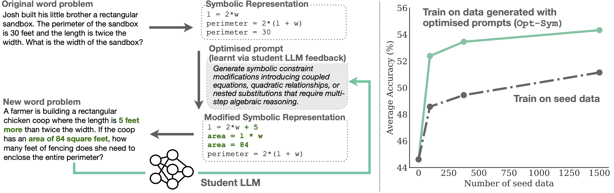

# Adaptive Problem Generation via Symbolic Representations

[Teresa Yeo](https://aserety.github.io/), [Myeongho Jeon](https://myeongho.com/), [Dulaj Weerakoon](linkedin.com/in/dulaj-weerakoon-91b0239a/), [Rui Qiao](https://qiaoruiyt.github.io/), [Alok Prakash](https://alokprakash.wordpress.com/), [Armando Solar-Lezama](https://people.csail.mit.edu/asolar/), [Archan Misra](https://sites.google.com/view/archan-misra)

### 🚧 Code Release Status  
> **Note**: We plan to release the code by the end of Feb 2026.

## Overview

<p align="center">
  <br>
  <em><b>Symbolic Data Generation with Prompt Optimization (Opt-Sym).</b> We transform math word problems into symbolic form, apply optimized prompts to modify their structure, and convert them back into new problems with automatic ground truth. A closed feedback loop improves prompt quality and generates more diverse, challenging training data. Models trained on Opt-Sym data achieve higher accuracy and better data efficiency than training on seed data alone.</em>
</p>

We present a method for generating training data for reinforcement learning with verifiable rewards to improve small open-weights language models on mathematical tasks. Existing approaches rely on fixed modifications that don't adapt to model capabilities and operate directly on word problems, limiting control over structure. We address this through **symbolic problem representation** (e.g., SymPy, SMT) and a **closed-loop framework** that learns modification strategies via prompt optimization. Experimental results demonstrate that both adaptive problem generation and symbolic representation contribute to improved math-solving ability and data efficiency.

If you use this code or find our work helpful, please consider citing:
``` bibtex
@misc{yeo2026adaptive,
      title={Adaptive Problem Generation via Symbolic Representations}, 
      author={Teresa Yeo and Myeongho Jeon and Dulaj Weerakoon and Rui Qiao and Alok Prakash and Armando Solar-Lezama and Archan Misra},
      year={2026},
      journal={arXiv preprint arXiv:2602.19187}
}
```
